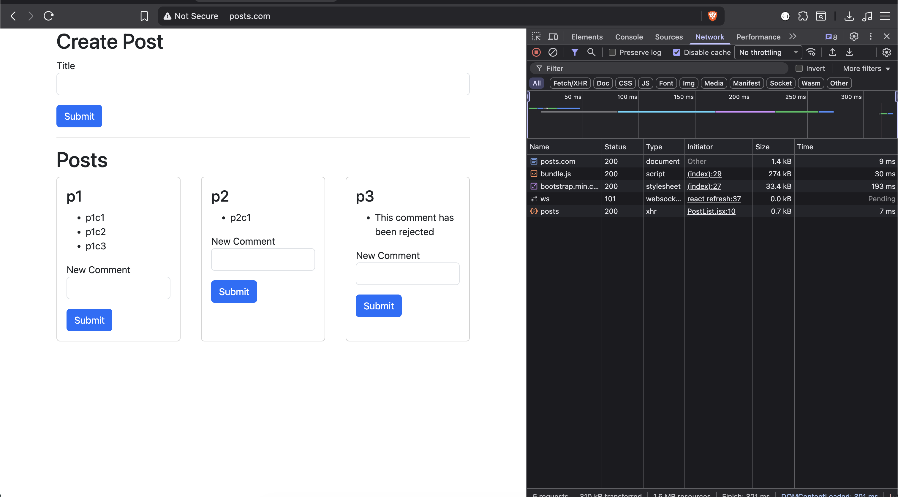

# blog-microservices

To create load balance and ingress controller -
kubectl apply -f https://raw.githubusercontent.com/kubernetes/ingress-nginx/controller-v1.13.3/deploy/static/provider/cloud/deploy.yaml

- Install docker desktop on macos
- enable kubernetes cluster in docker desktop (single node)
- make sure to have kubectl installed to interact with k8s (ingress-nginx loadbalancer added as config file)
- To install skaffold tool skaffold.dev => brew install skaffold
- front end app in created using create-react-app (migrate it to vite-react)

To make k8s working in local
Make this change in /etc/hosts file
127.0.0.1 posts.com

Application is available on http://posts.com/

To install skaffold tool skaffold.dev
brew install skaffold

To start the app use below code:
skaffold dev
